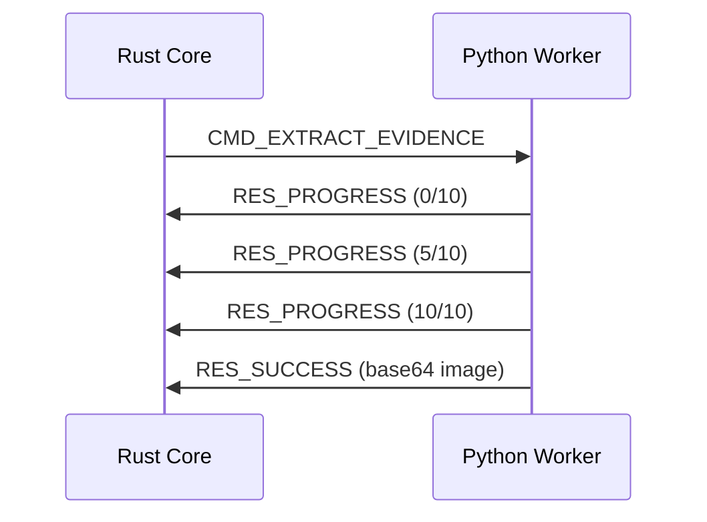
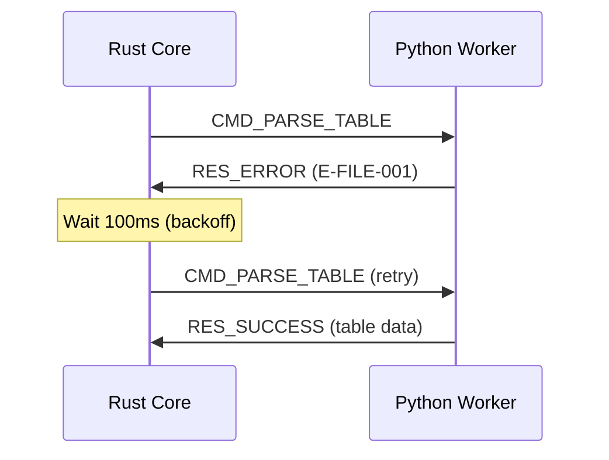

# IPC PROTOCOL v1.1 SPECIFICATION

**Version:** 1.1.0  
**Status:** Production-Ready  
**Last Updated:** 2025-12-25

---

## 🎯 Overview

This document defines the **Inter-Process Communication (IPC) protocol** between the Rust core and Python worker in TachFileTo. The protocol uses **stdio-based JSON messaging** with a standardized envelope structure.

### Design Principles

1. **Type Safety**: Strongly typed messages with schema validation
2. **Observability**: Every message has unique ID and timestamp
3. **Resilience**: Hierarchical error codes with recovery suggestions
4. **Performance**: Progress reporting for long-running operations

---

## 1. MESSAGE ENVELOPE

All IPC messages follow this universal structure:

```json
{
  "protocol_v": "1.0.0",
  "msg_id": "550e8400-e29b-41d4-a716-446655440000",
  "timestamp": 1703462400000,
  "type": "CMD_HANDSHAKE",
  "payload": { /* type-specific data */ }
}
```

### Envelope Fields

| Field | Type | Description |
|-------|------|-------------|
| `protocol_v` | String | Protocol version (semantic versioning) |
| `msg_id` | UUID | Unique message identifier for correlation |
| `timestamp` | i64 | Unix timestamp in milliseconds |
| `type` | MessageType | Enum defining message category |
| `payload` | Any | Type-specific payload (see sections below) |

### Implementation References

- **Rust**: [`protocol.rs`](file:///e:/DEV/TachFile_To/crates/tachfileto-core/src/ipc/protocol.rs#L22-L29)
- **Python**: [`protocol.py`](file:///e:/DEV/TachFile_To/backend/app/protocol.py#L34-L43)

---

## 2. MESSAGE TYPES

### Command Messages (Rust → Python)

| Type | Purpose | Payload |
|------|---------|---------|
| `CMD_HANDSHAKE` | Initialize worker connection | [`HandshakeRequestPayload`](#handshake-request) |
| `CMD_PING` | Health check | Empty `{}` |
| `CMD_EXTRACT_EVIDENCE` | Extract image from PDF bbox | [`ExtractEvidencePayload`](#extract-evidence) |
| `CMD_PARSE_TABLE` | Parse table from PDF page | [`ParseTablePayload`](#parse-table) |
| `CMD_SHUTDOWN` | Graceful worker termination | Empty `{}` |

### Response Messages (Python → Rust)

| Type | Purpose | Payload |
|------|---------|---------|
| `RES_HANDSHAKE` | Worker ready confirmation | [`HandshakeResponsePayload`](#handshake-response) |
| `RES_PONG` | Health check acknowledgment | Empty `{}` |
| `RES_SUCCESS` | Operation completed successfully | [`SuccessPayload`](#success-payload) |
| `RES_PROGRESS` | Long-running operation update | [`ProgressPayload`](#progress-payload) |
| `RES_ERROR` | Operation failed | [`ErrorPayload`](#error-payload) |
| `RES_ACK` | Generic acknowledgment | Empty `{}` |

---

## 3. PAYLOAD SPECIFICATIONS

### Handshake Request

**Type**: `CMD_HANDSHAKE`

```json
{
  "rust_version": "1.83.0",
  "expected_protocol_v": "1.0.0",
  "capabilities_requested": ["ocr", "table_detection"]
}
```

**Rust Definition**: [`protocol.rs#L33-L37`](file:///e:/DEV/TachFile_To/crates/tachfileto-core/src/ipc/protocol.rs#L33-L37)

### Handshake Response

**Type**: `RES_HANDSHAKE`

```json
{
  "worker_pid": 12345,
  "docling_version": "2.0.1",
  "python_version": "3.11.5",
  "capabilities_supported": ["ocr", "table_detection"],
  "max_memory_mb": 512,
  "status": "ready"
}
```

**Python Definition**: [`protocol.py#L61-L67`](file:///e:/DEV/TachFile_To/backend/app/protocol.py#L61-L67)

### Extract Evidence

**Type**: `CMD_EXTRACT_EVIDENCE`

```json
{
  "file_path": "/path/to/document.pdf",
  "page_index": 5,
  "bbox": {
    "x": 100.0,
    "y": 200.0,
    "width": 300.0,
    "height": 150.0,
    "unit": "pt"
  },
  "dpi": 150,
  "output_format": "jpeg",
  "quality": 85
}
```

**Field Details**:
- `page_index`: 0-based page number
- `bbox`: Bounding box in PDF coordinate system
- `dpi`: Resolution (72, 150, or 300 recommended)
- `quality`: JPEG compression quality (1-100)

**Rust Definition**: [`protocol.rs#L51-L61`](file:///e:/DEV/TachFile_To/crates/tachfileto-core/src/ipc/protocol.rs#L51-L61)

### Parse Table

**Type**: `CMD_PARSE_TABLE`

```json
{
  "file_path": "/path/to/document.pdf",
  "page_index": 3,
  "hint_bbox": {
    "x": 50.0,
    "y": 100.0,
    "width": 500.0,
    "height": 400.0,
    "unit": "pt"
  },
  "detection_confidence_threshold": 0.7,
  "language": "vie"
}
```

**Field Details**:
- `hint_bbox`: Optional region hint for table detection
- `detection_confidence_threshold`: Minimum confidence (0.0-1.0)
- `language`: ISO 639-3 language code

**Python Definition**: [`protocol.py#L79-L85`](file:///e:/DEV/TachFile_To/backend/app/protocol.py#L79-L85)

### Success Payload

**Type**: `RES_SUCCESS`

```json
{
  "req_id": "550e8400-e29b-41d4-a716-446655440000",
  "data": {
    "image_base64": "iVBORw0KGgoAAAANSUhEUgAA...",
    "dimensions": [800, 600]
  },
  "metadata": {
    "processing_time_ms": 234,
    "cache_hit": false
  }
}
```

**Rust Definition**: [`protocol.rs#L99-L105`](file:///e:/DEV/TachFile_To/crates/tachfileto-core/src/ipc/protocol.rs#L99-L105)

### Progress Payload

**Type**: `RES_PROGRESS`

```json
{
  "req_id": "550e8400-e29b-41d4-a716-446655440000",
  "stage": "ocr_processing",
  "current": 15,
  "total": 50,
  "stage_description": "Processing page 15 of 50",
  "eta_seconds": 120
}
```

**Use Case**: Report progress for operations taking >5 seconds

**Python Definition**: [`protocol.py#L104-L110`](file:///e:/DEV/TachFile_To/backend/app/protocol.py#L104-L110)

### Error Payload

**Type**: `RES_ERROR`

```json
{
  "req_id": "550e8400-e29b-41d4-a716-446655440000",
  "code": "E-FILE-001",
  "severity": "error",
  "message": "File not found: /path/to/missing.pdf",
  "details": {
    "attempted_path": "/path/to/missing.pdf",
    "cwd": "/current/working/dir"
  },
  "suggested_action": "Verify file path exists and is accessible",
  "timestamp": 1703462400000,
  "stack_trace": "Traceback (most recent call last):\n  ..."
}
```

**Rust Definition**: [`protocol.rs#L108-L121`](file:///e:/DEV/TachFile_To/crates/tachfileto-core/src/ipc/protocol.rs#L108-L121)

---

## 4. HIERARCHICAL ERROR CODES

### Error Code Format

`E-<CATEGORY>-<NUMBER>`

Example: `E-FILE-001` = File category, error #1

### Standard Error Categories

| Category | Prefix | Description |
|----------|--------|-------------|
| System | `E-SYS` | Internal errors, crashes, OOM |
| File | `E-FILE` | File I/O, permissions, not found |
| Validation | `E-VAL` | Invalid input, schema mismatch |
| Processing | `E-PROC` | PDF parsing, OCR failures |
| Memory | `E-MEM` | Memory exhaustion, allocation failures |
| OCR | `E-OCR` | Text recognition errors |

### Predefined Error Codes

| Code | Severity | Description | Suggested Action |
|------|----------|-------------|------------------|
| `E-SYS-001` | Fatal | Internal system error | Restart application |
| `E-FILE-001` | Error | File not found | Verify file path |
| `E-FILE-002` | Error | Permission denied | Check file permissions |
| `E-VAL-001` | Warning | Invalid input parameter | Review request payload |
| `E-PROC-001` | Error | PDF parsing failed | Check PDF integrity |
| `E-MEM-001` | Fatal | Memory exhausted | Close other applications |
| `E-OCR-001` | Warning | Low OCR confidence | Manual review required |

**Python Definition**: [`protocol.py#L113-L118`](file:///e:/DEV/TachFile_To/backend/app/protocol.py#L113-L118)

### Error Severity Levels

```rust
enum ErrorSeverity {
    Fatal,    // Requires worker restart
    Error,    // Operation failed, retry possible
    Warning,  // Degraded output, manual review needed
    Info      // Informational, no action required
}
```

---

## 5. HEARTBEAT MECHANISM

### Purpose

Monitor worker health and detect hangs/crashes.

### Protocol

**Rust → Python**: Send `CMD_PING` every 30 seconds

```json
{
  "protocol_v": "1.0.0",
  "msg_id": "ping-550e8400",
  "timestamp": 1703462400000,
  "type": "CMD_PING",
  "payload": {}
}
```

**Python → Rust**: Respond with `RES_PONG` within 5 seconds

```json
{
  "protocol_v": "1.0.0",
  "msg_id": "pong-550e8400",
  "timestamp": 1703462401000,
  "type": "RES_PONG",
  "payload": {}
}
```

### Failure Handling

If no `RES_PONG` received within 5 seconds:
1. Log warning
2. Retry ping (max 3 attempts)
3. If still unresponsive, kill and restart worker

**Implementation**: [`manager.rs`](file:///e:/DEV/TachFile_To/crates/tachfileto-core/src/ipc/manager.rs)

---

## 6. RATE LIMITING

### Request Limits

| Limit Type | Value | Rationale |
|------------|-------|-----------|
| Max requests/second | 20 | Prevent worker overload |
| Max concurrent extractions | 3 | Limit memory usage |
| Request timeout | 3000ms | Detect hangs early |
| Queue depth | 50 | Prevent unbounded growth |

### Backoff Strategy

On error, apply exponential backoff:

```
retry_delay = base_delay * (backoff_multiplier ^ attempt_number)
```

- `base_delay`: 100ms
- `backoff_multiplier`: 1.5
- `max_attempts`: 3

---

## 7. MESSAGE FLOW EXAMPLES

### Successful Evidence Extraction



### Error with Retry



---

## 8. TESTING GUIDELINES

### Unit Tests

Test message serialization/deserialization:

```rust
#[test]
fn test_handshake_roundtrip() {
    let payload = HandshakeRequestPayload {
        rust_version: "1.83.0".to_string(),
        expected_protocol_v: "1.0.0".to_string(),
        capabilities_requested: vec!["ocr".to_string()],
    };
    
    let msg = IpcMessage::new(MessageType::CmdHandshake, payload);
    let json = msg.to_json().unwrap();
    let parsed: IpcMessage<HandshakeRequestPayload> = 
        IpcMessage::from_json(&json).unwrap();
    
    assert_eq!(parsed.msg_type, MessageType::CmdHandshake);
}
```

### Integration Tests

Test full IPC communication:

```rust
#[tokio::test]
async fn test_ping_pong() {
    let manager = IpcManager::spawn_worker().await.unwrap();
    
    let response = manager.send_ping().await.unwrap();
    assert_eq!(response.msg_type, MessageType::ResPong);
}
```

---

## 9. VERSIONING STRATEGY

### Protocol Version

Current: `1.0.0`

### Compatibility Rules

- **Major version**: Breaking changes (incompatible message formats)
- **Minor version**: New message types (backward compatible)
- **Patch version**: Bug fixes, clarifications

### Migration Path

When upgrading protocol version:
1. Update `protocol_v` field in envelope
2. Add new message types to enum
3. Maintain backward compatibility for 1 major version
4. Document migration guide in this spec

---

## 10. APPENDIX

### Complete Message Type Enum

**Rust**:
```rust
pub enum MessageType {
    CmdHandshake,
    ResHandshake,
    CmdPing,
    ResPong,
    CmdExtractEvidence,
    CmdParseTable,
    ResSuccess,
    ResProgress,
    ResError,
    CmdShutdown,
    ResAck,
}
```

**Python**:
```python
class MessageType(str, Enum):
    CMD_HANDSHAKE = "CMD_HANDSHAKE"
    RES_HANDSHAKE = "RES_HANDSHAKE"
    CMD_PING = "CMD_PING"
    RES_PONG = "RES_PONG"
    CMD_EXTRACT_EVIDENCE = "CMD_EXTRACT_EVIDENCE"
    CMD_PARSE_TABLE = "CMD_PARSE_TABLE"
    RES_SUCCESS = "RES_SUCCESS"
    RES_PROGRESS = "RES_PROGRESS"
    RES_ERROR = "RES_ERROR"
    CMD_SHUTDOWN = "CMD_SHUTDOWN"
    RES_ACK = "RES_ACK"
```

---

**For implementation examples, see:**
- [`ipc_test.rs`](file:///e:/DEV/TachFile_To/crates/tachfileto-core/examples/ipc_test.rs)
- [`main.py`](file:///e:/DEV/TachFile_To/backend/app/main.py)
