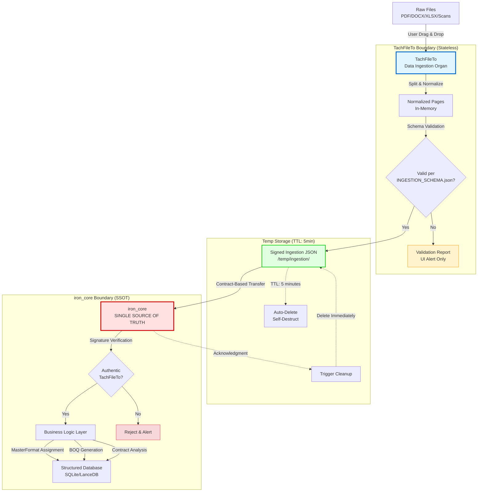
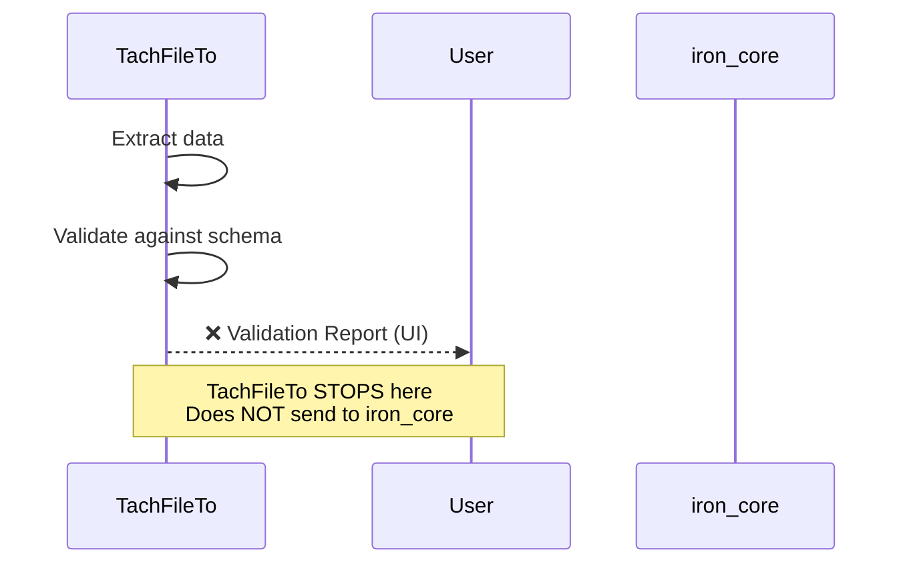
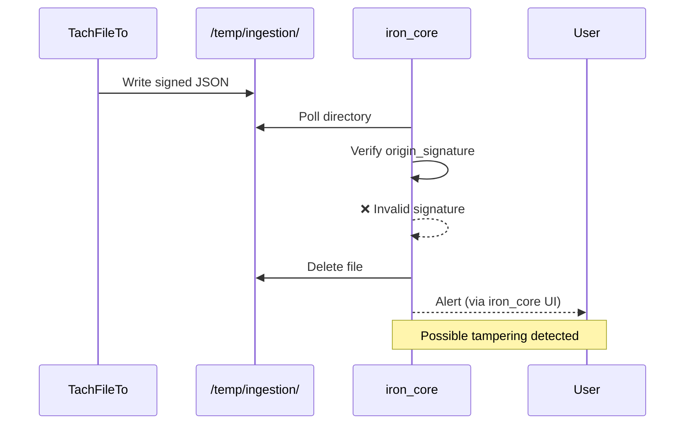
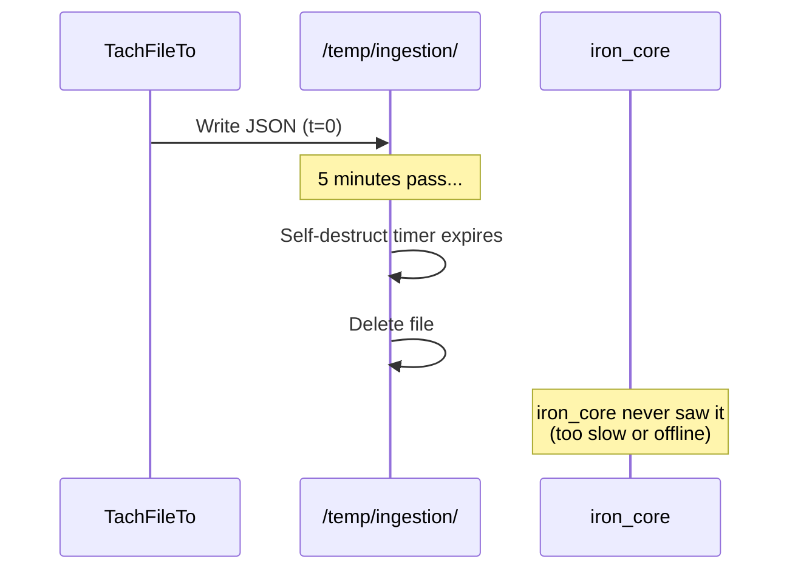

# TachFileTo Ecosystem Interaction Diagram

**Version:** 1.0.0  
**Purpose:** Visual representation of data flow and power boundaries in Elite 10 ecosystem  
**Last Updated:** 2026-01-10

---

## Data Flow Architecture



---

## Component Descriptions

### TachFileTo Boundary (Blue)
**Role:** Data cleaning and normalization  
**State:** Stateless (no persistence beyond runtime)  
**Authority:** NONE - cannot make business decisions

**Responsibilities:**
- Extract pages from multi-format documents
- Normalize ASCII/Unicode (Vietnamese diacritics)
- Detect content types (table/text/image)
- Generate confidence scores
- Sign output with Ed25519 private key

**Forbidden:**
- Assign MasterFormat codes
- Calculate quantities or prices
- Persist data beyond temp directory
- Make business logic inferences

---

### Temp Storage (Green)
**Location:** `/temp/ingestion/`  
**Lifetime:** 5 minutes maximum  
**Format:** JSON per `INGESTION_SCHEMA.json`

**Self-Destruct Mechanism:**
1. TachFileTo writes JSON + timestamp
2. Background thread monitors every 30 seconds
3. Objects older than 5 minutes → automatic deletion
4. iron_core acknowledgment → immediate deletion

**Security:**
- Each object signed with `origin_signature`
- SHA-256 checksum for integrity
- No cross-project data mixing

---

### iron_core Boundary (Red)
**Role:** Business logic and SSOT enforcement  
**State:** Persistent (SQLite/LanceDB)  
**Authority:** ABSOLUTE - final decision maker

**Responsibilities:**
- Poll `/temp/ingestion/` directory
- Verify `origin_signature` authenticity
- Validate against `INGESTION_SCHEMA.json`
- Reject invalid/tampered objects
- Execute business logic (MasterFormat, BOQ, pricing)
- Persist to structured database

**Rejection Criteria:**
- Invalid signature (not from TachFileTo)
- Schema validation failure
- Checksum mismatch
- Unknown `document_type`

---

## Boundary Enforcement Rules

### Rule 1: One-Way Data Flow
```
TachFileTo → iron_core  ✅
iron_core → TachFileTo  ❌
```

**Rationale:** TachFileTo is a "dumb pipe" - it cannot receive feedback or instructions from iron_core. This prevents circular dependencies and logic leakage.

---

### Rule 2: Contract-Only Communication
```
Direct function calls     ❌
Shared database access    ❌
JSON contract exchange    ✅
```

**Rationale:** Forces explicit schema definition and prevents tight coupling.

---

### Rule 3: iron_core Veto Power
```
TachFileTo: "Here's valid JSON"
iron_core:  "I reject it anyway" ✅
```

**Rationale:** iron_core has absolute authority. Even schema-valid objects can be rejected based on business rules unknown to TachFileTo.

---

### Rule 4: No State Persistence in TachFileTo
```
UI preferences (theme, window size)    ✅
Recent files list                      ❌
Project metadata                       ❌
Cached extraction results              ❌
```

**Rationale:** Prevents context leakage between projects and ensures clean slate on each run.

---

## Error Handling Protocol

### Scenario 1: Schema Validation Failure


**Outcome:** User sees error in UI. No data sent to iron_core.

---

### Scenario 2: Signature Verification Failure


**Outcome:** iron_core rejects and deletes. User alerted via iron_core interface (not TachFileTo).

---

### Scenario 3: TTL Expiration


**Outcome:** Data lost. User must re-export from TachFileTo.

---

## Integration with Nghị định 254/2025/NĐ-CP

### Document Type Mapping

| `document_type` (Schema)     | Nghị định 254/2025 Article | Purpose                              |
|------------------------------|----------------------------|--------------------------------------|
| `BOQ_RAW`                    | Article 12, Section 3.a    | Bill of Quantities (raw extraction)  |
| `CONTRACT_RAW`               | Article 12, Section 3.b    | Contract terms and conditions        |
| `INVOICE_METADATA`           | Article 15, Section 4      | Payment request metadata             |
| `ACCEPTANCE_LOG_RAW`         | Article 12, Section 3.a    | Biên bản nghiệm thu khối lượng       |
| `ADJUSTMENT_ADDENDUM`        | Article 18, Section 2      | Price adjustment documentation       |
| `DRAWING_METADATA`           | Article 12, Section 3.c    | Technical drawing references         |

**Compliance Note:** The 2-day payment processing requirement (Article 15) is enforced by iron_core, NOT TachFileTo. TachFileTo only ensures document types are correctly classified.

---

## Security Boundaries

### Filesystem Isolation

```
TachFileTo Access:
  ✅ /temp/ingestion/          (write-only)
  ✅ User-selected files       (read-only, one-time)
  ❌ iron_core workspace
  ❌ Other projects
  ❌ System directories

iron_core Access:
  ✅ /temp/ingestion/          (read + delete)
  ✅ Own database directory
  ❌ TachFileTo config files
  ❌ Other projects
```

---

### Network Isolation

```
TachFileTo:
  ❌ No external HTTP requests
  ❌ No cloud uploads
  ❌ No telemetry

iron_core:
  ✅ May access local network (if configured)
  ❌ No automatic cloud sync
```

---

## Revision History

| Version | Date       | Changes                                      |
|---------|------------|----------------------------------------------|
| 1.0.0   | 2026-01-10 | Initial diagram with Nghị định 254/2025 compliance |

---

**Authority:** Elite 10 Ecosystem Architecture Board  
**Status:** Constitutional (Non-Negotiable)
