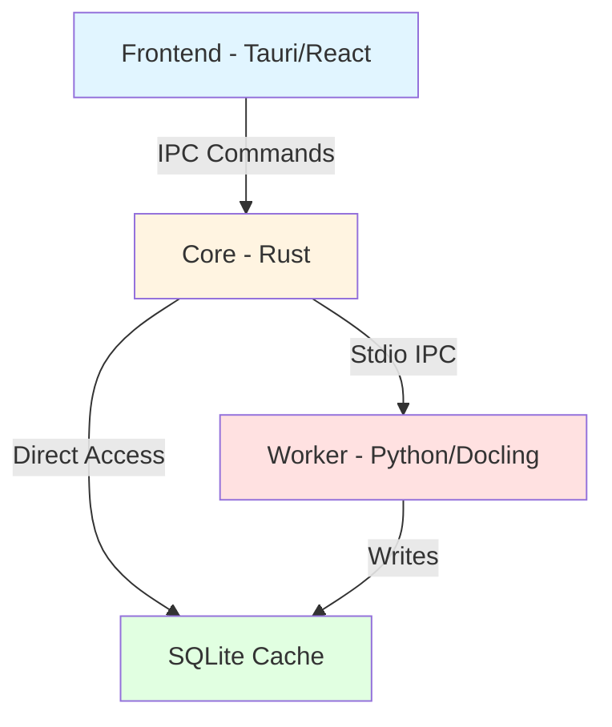

🚨 **TÀI LIỆU ĐÃ LỖI THỜI - KHÔNG SỬ DỤNG**
**Version thực tế:** V2.3 (Perception Engine + Polars 0.52)
**Cập nhật cuối:** 2025-12-26
**Trạng thái:** ARCHIVED - Chỉ để tham khảo lịch sử
→ Xem [ARCHITECTURE_V2.3.md](file:///e:/DEV/TachFile_To/docs/specs/ARCHITECTURE_V2.3.md) để biết source of truth

# TachFileTo - Architecture Guide

**Version:** 1.1.0  
**Last Updated:** 2025-12-25  
**Status:** Production-Ready Core

---

## 🎯 Project Overview

**TachFileTo** is a defensive, high-performance desktop application for Vietnamese construction quantity surveyors (QS). It extracts tabular data from legacy PDF documents (including TCVN3/VNI encoded files), performs automated calculations, and generates Excel reports.

### Core Philosophy

> **"Never trust, always verify. Never load what you don't need."**

- **Lazy Loading**: Only process data when explicitly requested
- **Defensive Execution**: Multiple fallback strategies for every operation
- **Bounded Resources**: Hard memory limits enforced at runtime
- **Transparent Operations**: Users see progress, not freezes

---

## 🏗️ Three-Tier Architecture



### Layer Responsibilities

| Layer | Technology | Responsibilities |
|-------|-----------|------------------|
| **Frontend** | Tauri + React + TypeScript | UI rendering, user interaction, evidence display |
| **Core** | Rust | IPC management, legacy font fixing, business logic, caching |
| **Worker** | Python + Docling | PDF parsing, OCR, table extraction |
| **Storage** | SQLite | Persistent cache, project data, evidence blobs |

---

## 📚 Documentation Map

### Specifications (Detailed Technical Docs)

1. **[Architecture Master v1.1](file:///e:/DEV/TachFile_To/docs/specs/ARCHITECTURE_MASTER_V1.1.md)**
   - Dynamic RAM quotas calculation
   - Memory tier strategies (InMemory, Mmap, Streaming)
   - Error recovery and fallback mechanisms

2. **[IPC Protocol v1.1](file:///e:/DEV/TachFile_To/docs/specs/IPC_PROTOCOL_V1.1.md)**
   - Message envelope structure
   - Request/Response payloads
   - Hierarchical error codes (E-SYS, E-FILE, E-OCR, E-MEM)
   - Heartbeat and health monitoring

3. **[Evidence Loading v1.0](file:///e:/DEV/TachFile_To/docs/specs/EVIDENCE_LOADING_V1.0.md)**
   - Triple-layer caching architecture
   - Prefetching strategies (hover-based, viewport-based)
   - Rate limiting and queue management

4. **[Business Rules VN v1.0](file:///e:/DEV/TachFile_To/docs/specs/BUSINESS_RULES_VN_V1.0.md)**
   - Legacy font conversion (TCVN3/VNI → Unicode)
   - Vietnamese construction terminology
   - Currency rounding rules (VND)
   - Tolerance calculations for quantities

---

## 🚀 Quick Start

### Prerequisites

- **Rust**: 1.83.0 or later
- **Python**: 3.11+ with `docling` library
- **Node.js**: 18+ (for frontend development)

### Environment Setup

```bash
# Clone repository
git clone <repo-url>
cd TachFile_To

# Install Rust dependencies
cargo build

# Install Python dependencies
cd backend
pip install -r requirements.txt

# Install frontend dependencies (when available)
cd ../frontend
npm install
```

### Running the Application

```bash
# Terminal 1: Start Python worker
cd backend
python -m app.main

# Terminal 2: Run Rust core
cd crates/tachfileto-core
cargo run --example ipc_test
```

---

## 🔍 Key Concepts

### Evidence
A **cropped image** extracted from a specific bounding box on a PDF page, used to visually verify extracted data.

### Bounding Box (BBox)
Coordinates `[x, y, width, height]` in PDF points (pt) defining a rectangular region.

### Docling
Python library for advanced PDF parsing, table detection, and OCR.

### IPC (Inter-Process Communication)
Stdio-based JSON message exchange between Rust core and Python worker.

### Memory Tiers
Strategy selection based on file size:
- **Tier 1**: <50MB → Load entirely in memory
- **Tier 2**: 50-200MB → Memory-mapped with fallback
- **Tier 3**: >200MB → Streaming (10-20 pages per batch)

---

## 📊 Current Implementation Status

| Component | Status | File References |
|-----------|--------|-----------------|
| IPC Protocol | ✅ Complete | [`protocol.rs`](file:///e:/DEV/TachFile_To/crates/tachfileto-core/src/ipc/protocol.rs), [`protocol.py`](file:///e:/DEV/TachFile_To/backend/app/protocol.py) |
| IPC Manager | ✅ Complete | [`manager.rs`](file:///e:/DEV/TachFile_To/crates/tachfileto-core/src/ipc/manager.rs) |
| Message Router | ✅ Complete | [`router.rs`](file:///e:/DEV/TachFile_To/crates/tachfileto-core/src/ipc/router.rs) |
| Legacy Font Fixer | ✅ Complete | [`text/mod.rs`](file:///e:/DEV/TachFile_To/crates/tachfileto-core/src/text/mod.rs) |
| Python Worker | ✅ Complete | [`main.py`](file:///e:/DEV/TachFile_To/backend/app/main.py) |
| Evidence Extraction | 🚧 In Progress | - |
| Frontend UI | ⏳ Planned | - |

---

## 🛠️ Development Guidelines

### Code Organization

```
TachFile_To/
├── crates/
│   └── tachfileto-core/     # Rust core library
│       ├── src/
│       │   ├── ipc/         # IPC protocol and management
│       │   └── text/        # Legacy font fixing
│       └── examples/        # Integration tests
├── backend/
│   └── app/                 # Python worker
│       ├── engine/          # PDF processing logic
│       ├── protocol.py      # IPC message definitions
│       └── main.py          # Worker entry point
└── docs/
    ├── GUIDE.md            # This file
    └── specs/              # Detailed specifications
```

### Testing Strategy

- **Unit Tests**: Rust (`cargo test`), Python (`pytest`)
- **Integration Tests**: IPC communication (`ipc_test.rs`)
- **Stress Tests**: Large file handling (>500MB PDFs)

---

## 🔗 External References

- [Docling Documentation](https://github.com/DS4SD/docling)
- [Tauri Framework](https://tauri.app/)
- [Rust IPC Patterns](https://rust-lang.github.io/async-book/)

---

## 📝 Version History

| Version | Date | Changes |
|---------|------|---------|
| 1.1.0 | 2025-12-25 | Added dynamic RAM quotas, hierarchical error codes, progress reporting |
| 1.0.0 | 2025-12-20 | Initial architecture with basic IPC and font fixing |

---

**For detailed technical specifications, navigate to the [specs directory](file:///e:/DEV/TachFile_To/docs/specs/).**
