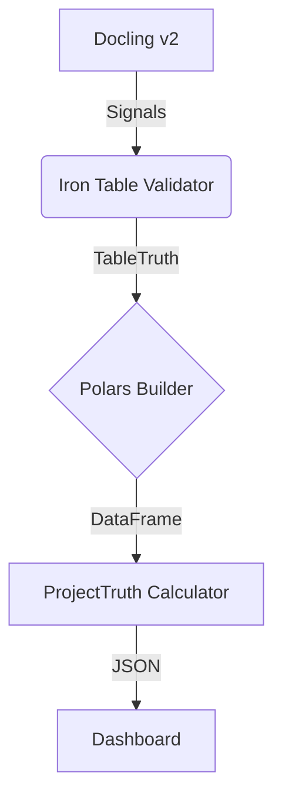

# MISSION 018: THE POLARS ENGINE

**Status:** ACTIVE  
**Previous Mission:** [017 - Deep Table Logic](../specs/IRON_TRUTH_CONTRACT_V1.0.md)  
**Goal:** High-Performance Geometric Data Execution  
**Engine:** Polars (Rust)

---

## 1. MISSION OBJECTIVE
**"The Glass Panel is Ready, Now Bring the Engine."**

Connect the hardened `TableTruth` structures (Mission 017) to the Polars execution engine to generate `ProjectTruth`.  
This layer is **pure execution**. It does not think; it calculates.

---

## 2. SCOPE OF WORK

### 2.1 The Bridge (Iron -> Polars)
- **Input:** `TableTruth` (Verified, Normalized)
- **Output:** `polars::DataFrame`
- **Method:** Explicit `Series` construction.
- **Rule:** 1:1 mapping. No schema inference.

### 2.2 Project Truth Derivation
- Calculate `ProjectTruth` aggregates from the DataFrame:
  - `total_cost`
  - `start_date` / `end_date`
  - `risk_factors`
- **Constraint:** All logic must be deterministic arithmetic matches against strict rules.

### 2.3 Integration Testing
- Prove that `Docling` -> `Iron Table` -> `Polars` works end-to-end.
- Validate memory usage stays within the 500MB budget.

---

## 3. NON-GOALS (STRICT)
- ❌ **No Fuzzy Matching:** If a column name doesn't match the contract, it is dropped or flagged, not guessed.
- ❌ **No UI Logic:** We produce data, we do not decide how to show it (colors, etc are defined by status rules, but rendering is UI).
- ❌ **No Python Logic:** This entire mission happens inside Rust (`libs/iron_table` + `libs/elite_polars`?).

---

## 4. ARCHITECTURE

---

## 5. SUCCESS CRITERIA
1. **Compilation:** `cargo build` clean with Polars feature enabled.
2. **Performance:** DataFrame creation < 50ms per table.
3. **Correctness:** `ProjectTruth` matches expectation for standard input.
4. **Safety:** No panics on malformed input (handled by Iron Table layer before reaching Polars, or safe builders).

---

## 6. IMPLEMENTATION PLAN

> [!IMPORTANT]
> **New Crate:** We will create `libs/iron_engine` to hold the Polars dependency. `libs/iron_table` will remain lightweight (contracts only).
> **Polars Version:** We will use `polars` latest stable with `lazy` feature disabled (strict mode) unless performance requires it.

### 6.1 Crate Structure

#### [libs/iron_table] (The Contracts)
**[MODIFY]** [lib.rs](file:///e:/DEV/elite_9_VN-ecosystem/app-tool-TachFileTo/libs/iron_table/src/lib.rs)
- Add `ProjectTruth` struct definition (and children: `Financials`, `RiskItem`, etc.) per `IRON_TRUTH_CONTRACT_V1.0.md`.
- Ensure strict Serde derivation.

---

#### [libs/iron_engine] (New Crate)
**[NEW]** [Cargo.toml](file:///e:/DEV/elite_9_VN-ecosystem/app-tool-TachFileTo/libs/iron_engine/Cargo.toml)
- Dependency on `polars` (core, series, dataframe).
- Dependency on `iron_table`.

**[NEW]** [src/lib.rs](file:///e:/DEV/elite_9_VN-ecosystem/app-tool-TachFileTo/libs/iron_engine/src/lib.rs)
- Mod `transformer`.
- Mod `calculator`.

**[NEW]** [src/transformer.rs](file:///e:/DEV/elite_9_VN-ecosystem/app-tool-TachFileTo/libs/iron_engine/src/transformer.rs)
- Function `to_dataframe(table: &TableTruth) -> Result<DataFrame>`.
- Loops through `TableSchema.columns`.
- Maps atomic types to `Series`.
- No inference.

**[NEW]** [src/calculator.rs](file:///e:/DEV/elite_9_VN-ecosystem/app-tool-TachFileTo/libs/iron_engine/src/calculator.rs)
- Function `derive_project_truth(df: &DataFrame) -> Result<ProjectTruth>`.
- Implements the deterministic arithmetic rules.

---

#### [libs/iron_python_bridge]
**[MODIFY]** [src/lib.rs](file:///e:/DEV/elite_9_VN-ecosystem/app-tool-TachFileTo/libs/iron_python_bridge/src/lib.rs)
- Expose `engine_process_table` function to Python.

---

### 6.2 Verification Plan

#### Automated Tests
1. **Unit Tests (iron_engine)**
   - `test_conversion_exact_match`: Create a manual `TableTruth` -> Convert -> Check DataFrame dtypes and values.
   - `test_project_truth_math`: Feed known DataFrame -> Check `ProjectTruth` numbers.
   
2. **Integration Test**
   - Mock a JSON from Docling (stub).
   - Feed to `iron_table` validation.
   - Feed to `iron_engine`.
   - Assert Output JSON.

#### Manual Verification
- Run `cargo test -p iron_engine`.
- Benchmarking: Ensure conversion is < 50ms for standard table.

---

## 7. POST-FOUNDATION UPDATES

> [!NOTE]
> **Status as of 2026-01-31:** Mission 018 Foundation is **COMPLETE** and **RELEASE-READY**.

### ✅ Polars 0.52 Upgrade (2026-01-31)
- **Migrated from:** Polars 0.45 (initial foundation)
- **Migrated to:** Polars `=0.52.0` (pinned to prevent drift)
- **Breaking changes:** ZERO - API compatibility verified
- **Test status:** 7/7 passing (3 transformer + 4 calculator)

### ✅ TDD Implementation Complete
**Layer 1 - Structural Determinism (Transformer):**
- `test_to_dataframe_exact_schema_match` - Schema/type/value verification
- `test_to_dataframe_reject_schema_mismatch` - Contract enforcement (added explicit row validation)
- `test_dataframe_deterministic` - Byte-identical output guarantee

**Layer 2 - Arithmetic Truth (Calculator):**
- `test_project_truth_status_thresholds` - Hard boundaries (4.9% vs 5.0%, 14.9% vs 15.0%)
- `test_financial_aggregation_exact` - Exact arithmetic (assert_eq, no tolerance)
- `test_deviation_calculation_exact` - Deterministic percentage (5.0% exact)
- `test_derive_project_truth_deterministic` - End-to-end idempotence

### ✅ Release Audit Results

**A. Determinism Scan:** ✅ PASS
- Zero non-deterministic Polars operations (no hash/random/shuffle/uncontrolled parallelism)
- Fixed `Utc::now()` - timestamp now provided by caller for full idempotence

**B. Panic Audit:** ✅ PASS
- Zero `.unwrap()` in production code
- Zero `.expect()` in production code
- All errors use `Result` propagation

**C. Implementation Status:** ✅ COMPLETE
- Financial aggregation: Implemented (exact column sums)
- Deviation calculation: Implemented (budget vs actual with percentage)
- Status determination: Implemented (hard thresholds: 5%, 15%)
- **No longer skeleton** - fully functional with TDD coverage

### 🔒 Mission 018 Status: FROZEN
No new features will be added to this mission. Integration with Docling (Mission 019) will proceed.

