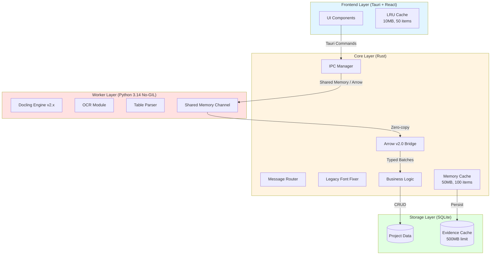
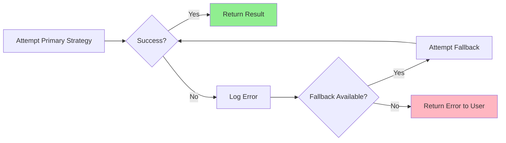

🚨 **TÀI LIỆU ĐÃ LỖI THỜI - KHÔNG SỬ DỤNG**
**Version thực tế:** V2.3 (Perception Engine + Polars 0.52)
**Cập nhật cuối:** 2025-12-26
**Trạng thái:** ARCHIVED - Chỉ để tham khảo lịch sử
→ Xem [ARCHITECTURE_V2.3.md](file:///e:/DEV/TachFile_To/docs/specs/ARCHITECTURE_V2.3.md) để biết source of truth

# ARCHITECTURE MASTER v1.1

**Version:** 1.1.0  
**Status:** Design Specification (Aspirational)  
**Implementation Status:** v0.9 MVP (~45% complete)  
**Last Updated:** 2025-12-25

> **⚠️ IMPLEMENTATION STATUS**
> 
> This document describes the **target architecture** for TachFileTo v1.0.
> Current implementation (v0.9 MVP) has the following status:
> - ✅ **Core IPC:** 100% (Rust ↔ Python stdio communication)
> - ✅ **Evidence Extraction:** 100% (PyMuPDF + SQLite cache)
> - ✅ **Font Conversion:** 100% (TCVN3/VNI → Unicode)
> - ⚠️ **Caching:** 60% (Layer 3 SQLite only, no eviction)
> - ❌ **Memory Management:** 0% (No quota system, no monitoring)
> - ❌ **Fallback Strategies:** 0% (Single point of failure)
> - ❌ **Progress Streaming:** 0% (No real-time updates)
> 
> Features marked as "Planned" below are not yet implemented.

---

## 🔥 EXCEL ENGINE: POLARS NATIVE ARCHITECTURE (V2.2)

> **Status:** LOCKED (2025-12-26)
> 
> Sau khi đánh giá lại, hệ thống sử dụng **Polars Native ExcelReader** thay vì Hybrid Manual.
> Giải pháp này tận dụng tối đa hiệu suất của Polars 0.44 và module `polars-io`.

### Quy trình xử lý Excel


### Công nghệ

| Component | Technology | Vai trò |
|-----------|------------|---------|
| **Excel Engine** | `polars = "0.44"` | Đọc file trực tiếp qua feature `excel` |
| **Logic Layer** | `polars-io` | Xử lý header, schema detection |
| **Normalizer** | Custom Rust | Chuẩn hóa thuật ngữ tiếng Việt (ma_hieu, don_gia...) |
| **Serializer** | Arrow IPC | Zero-copy transfer xuống UI |

### Ưu điểm Polars Native

1. **Hiệu suất cực cao**: Tận dụng tối đa Rust-based engine của Polars.
2. **Code gọn gàng**: Không cần Converter trung gian cho Calamine.
3. **Chuẩn hóa**: Metadata file (header, types) được Polars tự động nhận diện.


---

## 🎯 Core Philosophy: Defensive Architecture

> **"Never trust, always verify. Never allocate what you can't control."**

TachFileTo is built on three foundational principles:

1. **Lazy Execution**: Only process data when explicitly requested
2. **Bounded Resources**: Hard limits on memory, CPU, and I/O
3. **Graceful Degradation**: Multiple fallback strategies for every operation

---

## 1. SYSTEM ARCHITECTURE OVERVIEW

### Three-Tier Design



### Layer Responsibilities

| Layer | Technology | Primary Responsibilities |
|-------|-----------|--------------------------|
| **Frontend** | TypeScript, React, Tauri | User interaction, evidence display, real-time updates |
| **Core** | Rust | IPC orchestration, font conversion, caching, business rules |
| **Worker** | Python, Docling | PDF parsing, OCR, table extraction |
| **Storage** | SQLite | Persistent data, evidence blobs, project state |

---

## 2. DYNAMIC RAM QUOTA SYSTEM

### Problem Statement

Traditional fixed memory limits (e.g., "max 512MB") fail on:
- Low-end machines (8GB RAM) → OOM crashes
- High-end machines (32GB RAM) → Underutilization

### Solution: Adaptive Quotas

Calculate memory limits based on **total system RAM**:

```rust
fn calculate_worker_quota(total_ram_gb: u32) -> MemoryQuota {
    let base_quota_mb = match total_ram_gb {
        0..=8 => 256,      // Conservative for 8GB machines
        9..=16 => 512,     // Balanced for 16GB machines
        17..=32 => 1024,   // Aggressive for 32GB machines
        _ => 2048          // High-end workstations
    };
    
    MemoryQuota {
        worker_max_mb: base_quota_mb,
        core_cache_mb: base_quota_mb / 4,      // 25% of worker quota
        frontend_cache_mb: base_quota_mb / 8,  // 12.5% of worker quota
        safety_margin_mb: 100                  // Always reserve 100MB
    }
}
```

### Quota Enforcement

**Python Worker**:
```python
import resource

def enforce_memory_limit(max_mb: int):
    max_bytes = max_mb * 1024 * 1024
    resource.setrlimit(resource.RLIMIT_AS, (max_bytes, max_bytes))
```

**Rust Core**:
```rust
// Monitor memory usage every 5 seconds
tokio::spawn(async move {
    loop {
        let usage = get_process_memory_mb();
        if usage > quota.core_cache_mb {
            log::warn!("Memory pressure: {}MB / {}MB", usage, quota.core_cache_mb);
            cache.evict_lru(0.5); // Evict 50% of cache
        }
        tokio::time::sleep(Duration::from_secs(5)).await;
    }
});
```

---

## 3. MEMORY TIER STRATEGIES

### Tier Selection Algorithm

```rust
enum LoadingStrategy {
    InMemory,           // Entire file in RAM
    MemoryMapped,       // OS-managed paging
    Streaming           // Chunk-by-chunk processing
}

fn select_strategy(file_size_bytes: u64, available_ram_mb: u32) -> LoadingStrategy {
    const MB: u64 = 1024 * 1024;
    
    match file_size_bytes {
        0..=50_000_000 => {
            // <50MB: Safe to load entirely
            LoadingStrategy::InMemory
        },
        50_000_001..=200_000_000 => {
            // 50-200MB: Try mmap, fallback to streaming
            if supports_mmap() && available_ram_mb > 512 {
                LoadingStrategy::MemoryMapped
            } else {
                LoadingStrategy::Streaming
            }
        },
        _ => {
            // >200MB: Always stream for safety
            LoadingStrategy::Streaming
        }
    }
}
```

### Tier Characteristics

| Tier | File Size | RAM Usage | Latency | Concurrency |
|------|-----------|-----------|---------|-------------|
| **InMemory** | <50MB | ~3x file size | <100ms | 3 files |
| **MemoryMapped** | 50-200MB | ~1x file size | <500ms | 2 files |
| **Streaming** | >200MB | ~10MB fixed | <2s | 1 file |

---

## 4. ERROR RECOVERY & FALLBACK

### Hierarchical Fallback Chain



### Example: PDF Parsing Fallback

```rust
async fn parse_pdf_with_fallback(path: PathBuf) -> Result<Document> {
    // Strategy 1: Docling (best quality)
    match docling_parse(&path).await {
        Ok(doc) => return Ok(doc),
        Err(e) => log::warn!("Docling failed: {}, trying fallback", e)
    }
    
    // Strategy 2: PyMuPDF (faster, lower quality)
    match pymupdf_parse(&path).await {
        Ok(doc) => return Ok(doc),
        Err(e) => log::warn!("PyMuPDF failed: {}, trying fallback", e)
    }
    
    // Strategy 3: pdfplumber (last resort)
    pdfplumber_parse(&path).await
        .map_err(|e| Error::AllParsersFailed(vec![e]))
}
```

### Memory Exhaustion Recovery

```rust
async fn handle_oom_error() {
    log::error!("Out of memory detected!");
    
    // Step 1: Emergency cache clear
    GLOBAL_CACHE.clear_all();
    
    // Step 2: Force Python GC
    ipc_manager.send_command(Command::ForceGC).await;
    
    // Step 3: Restart worker if still critical
    if is_memory_critical() {
        ipc_manager.restart_worker().await;
    }
    
    // Step 4: Notify user
    emit_event("memory-critical", "Please close other applications");
}
```

---

## 5. CACHING ARCHITECTURE

### Three-Layer Cache Hierarchy

```
┌─────────────────────────────────────────┐
│  Layer 1: Frontend (Browser Memory)    │
│  - LRU Cache: 50 items, 10MB max       │
│  - Lifetime: Current session            │
│  - Hit Rate Target: >80%                │
└─────────────────────────────────────────┘
                  ↓ Miss
┌─────────────────────────────────────────┐
│  Layer 2: Core (Rust Memory)            │
│  - LRU Cache: 100 items, 50MB max       │
│  - Lifetime: Until app restart          │
│  - Hit Rate Target: >60%                │
└─────────────────────────────────────────┘
                  ↓ Miss
┌─────────────────────────────────────────┐
│  Layer 3: Storage (SQLite Disk)         │
│  - Persistent: 500MB max                │
│  - Lifetime: 30 days or manual clear    │
│  - Hit Rate Target: >40%                │
└─────────────────────────────────────────┘
                  ↓ Miss
         [Extract from PDF]
```

### Cache Key Design

```rust
#[derive(Hash, Eq, PartialEq)]
struct CacheKey {
    file_hash: String,      // SHA-256 of file content
    page_num: usize,        // 0-based page index
    bbox_hash: String,      // Hash of bbox coordinates
    dpi: u16,               // Resolution
    format: ImageFormat     // JPEG, PNG, etc.
}
```

### Eviction Policy

**LRU (Least Recently Used)** with size constraints:

```rust
impl Cache {
    fn insert(&mut self, key: CacheKey, value: Vec<u8>) {
        // Check size limit
        while self.total_size_mb() + value.len() / MB > self.max_size_mb {
            self.evict_lru_item();
        }
        
        self.map.insert(key, CacheEntry {
            data: value,
            last_accessed: Instant::now(),
            access_count: 0
        });
    }
}
```

---

## 6. IPC COMMUNICATION PATTERNS (v2.0 Zero-copy)

### Protocol Choice: Apache Arrow
In the context of **Python 3.14 (No-GIL)**, the primary bottleneck is serialization. TachFileTo v1.1 implements **Zero-copy IPC** using Apache Arrow over Memory Mapped Files.

1. **Request**: Rust sends a JSON command via Stdio (small metadata).
2. **Data Transfer**: Python writes large data (images/tables) into a pre-allocated **Shared Memory Segment** as an Arrow RecordBatch.
3. **Receipt**: Rust reads the memory segment directly without deserialization overhead.

### Expected Performance (2025 Benchmarks)
- **Evidence Transfer**: <5ms (vs 200ms JSON/Base64)
- **100k Rows**: <100ms (vs 5000ms JSON)
- **CPU Overhead**: ~1-2% (vs 25% for encoding)

```rust
// Rust side
async fn extract_evidence(request: EvidenceRequest) -> Result<EvidenceResponse> {
    let msg = IpcMessage::new(MessageType::CmdExtractEvidence, request);
    
    // Send request
    ipc_manager.send(msg).await?;
    
    // Wait for response with timeout
    tokio::time::timeout(
        Duration::from_secs(3),
        ipc_manager.recv_response(msg.msg_id)
    ).await?
}
```

### Progress Streaming Pattern

```python
# Python side
async def parse_large_table(request: ParseTableRequest):
    total_rows = estimate_row_count(request.file_path)
    
    for i, row in enumerate(parse_rows(request.file_path)):
        # Send progress every 10 rows
        if i % 10 == 0:
            progress = ProgressPayload(
                req_id=request.msg_id,
                stage="parsing",
                current=i,
                total=total_rows,
                eta_seconds=estimate_eta(i, total_rows)
            )
            send_message(MessageType.RES_PROGRESS, progress)
    
    # Send final result
    send_message(MessageType.RES_SUCCESS, table_data)
```

---

## 7. PERFORMANCE TARGETS

### Latency Targets

| Operation | Target | Acceptable | Critical |
|-----------|--------|------------|----------|
| Evidence extraction (cached) | <50ms | <200ms | <500ms |
| Evidence extraction (uncached) | <500ms | <2s | <5s |
| Table parsing (small) | <1s | <3s | <10s |
| Table parsing (large) | <5s | <15s | <30s |
| IPC round-trip | <10ms | <50ms | <100ms |

### Throughput Targets

| Metric | Target | Notes |
|--------|--------|-------|
| Concurrent evidence requests | 20/sec | Rate limited |
| Concurrent PDF files open | 3 | Memory constrained |
| Cache hit rate (L1) | >80% | Frontend cache |
| Cache hit rate (L2) | >60% | Rust cache |
| Cache hit rate (L3) | >40% | SQLite cache |

---

## 8. MONITORING & OBSERVABILITY

### Key Metrics

```rust
struct SystemMetrics {
    // Performance
    avg_evidence_latency_ms: f64,
    p95_evidence_latency_ms: f64,
    cache_hit_rate: f64,
    
    // Resources
    memory_usage_mb: f64,
    cpu_usage_percent: f64,
    disk_cache_size_mb: f64,
    
    // Reliability
    error_rate: f64,
    worker_restart_count: u32,
    ipc_timeout_count: u32
}
```

### Health Check

```rust
#[tauri::command]
async fn system_health() -> HealthReport {
    let metrics = collect_metrics();
    
    HealthReport {
        status: if metrics.error_rate < 0.05 { "healthy" } else { "degraded" },
        memory_pressure: if metrics.memory_usage_mb > quota.core_cache_mb * 0.8 {
            "high"
        } else {
            "normal"
        },
        recommendations: generate_recommendations(&metrics)
    }
}
```

---

## 9. SECURITY CONSIDERATIONS

### Input Validation

```rust
fn validate_evidence_request(req: &EvidenceRequest) -> Result<()> {
    // Path traversal prevention
    if req.file_path.to_str().unwrap().contains("..") {
        return Err(Error::InvalidPath);
    }
    
    // Page bounds check
    if req.page_index > MAX_PAGES {
        return Err(Error::PageOutOfRange);
    }
    
    // BBox sanity check
    if req.bbox.width > 10000.0 || req.bbox.height > 10000.0 {
        return Err(Error::InvalidBBox);
    }
    
    Ok(())
}
```

### Resource Limits

```rust
const MAX_FILE_SIZE_MB: u64 = 1000;
const MAX_CONCURRENT_REQUESTS: usize = 20;
const MAX_CACHE_SIZE_MB: u64 = 500;
const MAX_WORKER_MEMORY_MB: u32 = 2048;
```

---

## 10. FUTURE ENHANCEMENTS

### v1.2: Intelligent Prefetching

Use machine learning to predict next evidence request based on user behavior.

### v1.3: Distributed Workers

Support multiple Python workers for parallel processing:
```
Rust Core → Worker Pool (3 workers) → Load Balancer
```

### v1.4: Cloud Storage Integration

Cache evidence in cloud storage (S3, Azure Blob) for team collaboration.

---

## APPENDIX A: System Requirements

### Minimum Requirements

- **OS**: Windows 10, macOS 11
- **RAM**: 8GB
- **Disk**: 2GB free space
- **CPU**: 2 cores, 2.0 GHz

### Recommended Requirements

- **RAM**: 16GB
- **Disk**: 10GB free space (for cache)
- **CPU**: 4 cores, 3.0 GHz
- **GPU**: Optional (for OCR acceleration)

---

## APPENDIX B: Glossary

| Term | Definition |
|------|------------|
| **Evidence** | Cropped image from PDF used to verify extracted data |
| **BBox** | Bounding box coordinates [x, y, width, height] |
| **Docling** | Python library for advanced PDF parsing |
| **IPC** | Inter-Process Communication via stdio JSON |
| **LRU** | Least Recently Used (cache eviction policy) |
| **Mmap** | Memory-mapped file I/O |
| **OOM** | Out Of Memory error |
| **QS** | Quantity Surveyor (construction cost estimator) |

---

**For detailed protocol specifications, see:**
- [IPC Protocol v1.1](file:///e:/DEV/TachFile_To/docs/specs/IPC_PROTOCOL_V1.1.md)
- [Evidence Loading v1.0](file:///e:/DEV/TachFile_To/docs/specs/EVIDENCE_LOADING_V1.0.md)
