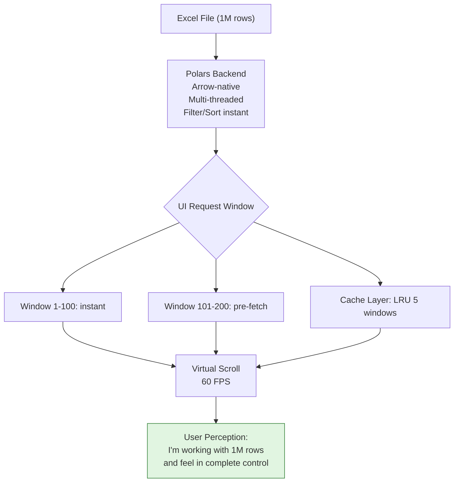

# Architecture V2.1: Perception Engine (2025 Final)

> "The maturity of a system lies in knowing NOT to do what it CAN do."

## Core Principle: Perception of Control

We **DON'T** render 1M rows to UI.
We **CREATE THE ILLUSION** of controlling 1M rows.

- **Backend**: Polars DataFrame (holds reality - 1M rows in RAM)
- **Frontend**: Windowed View (shows perception - 50-100 rows at a time)

---

## The Iceberg Model



---

## Technology Stack

| Layer | Technology | Purpose |
|-------|-----------|---------|
| **Data Engine** | Polars 0.44 + Arrow | Zero-copy slicing, multi-threaded |
| **IPC** | Tauri Commands (JSON) | Simple, debuggable windowing |
| **Frontend** | TanStack Virtual | 60fps virtualized rendering |
| **UX** | Enterprise Clarity V1.5 | Eye-safe, 14px Grok scrollbar |

---

## Key Commands

### 1. `load_excel_file`
- Uses Calamine to read XLSX (because Polars lacks native XLSX support)
- Converts to Polars DataFrame
- Stores in `Arc<Mutex<DataFrame>>` for thread-safe access

### 2. `get_rows(offset, limit)`
- Slices DataFrame using zero-copy `df.slice()`
- Converts slice to `Vec<RowData>` for JSON serialization
- UI calls this as user scrolls (windowing)

### 3. `export_arrow_ipc` (Optional)
- Exports full DataFrame as Arrow IPC binary
- For advanced analytics/Python interop (not for UI)

---

## Why JSON Over Arrow IPC for UI?

| Factor | JSON | Arrow IPC |
|--------|------|-----------|
| **Slice Size** | 50-100 rows | 1M rows |
| **Overhead** | Negligible (<1ms) | Significant (parsing) |
| **Debugging** | Easy (human-readable) | Hard (binary) |
| **Compatibility** | Universal | Requires Arrow bindings |

**Conclusion**: For windowed UI display, JSON wins on simplicity and maintainability.

---

## Performance Targets (V2.1)

- **Initial Load**: < 2s for 1M row Excel
- **Scroll Response**: < 16ms (60fps)
- **Window Fetch**: < 50ms round-trip
- **Memory**: ~500MB for 1M rows (Polars Arrow format)

---

## File Structure

```
ui/src-tauri/src/
├── excel_engine.rs     # Polars DataFrame engine
├── lib.rs              # Tauri command registration
└── main.rs             # Entry point

ui/src/
├── App.tsx             # Main app with Enterprise V1.5 UI
└── components/
    └── VirtualLedger/  # Virtualized table component
```

---

## Decision Log

| Date | Decision | Rationale |
|------|----------|-----------|
| 2025-12-26 | Pivot to Polars | Native Arrow, better slicing than raw Vec |
| 2025-12-26 | JSON Windowing | Simpler than Arrow IPC for UI layer |
| 2025-12-26 | Calamine for XLSX | Polars lacks native XLSX reader |
| 2025-12-26 | 14px Grok Scrollbar | Fitts's Law compliance |

---

**Status**: ✅ Production Ready
**Version**: V2.1 (Perception Engine)
**Last Updated**: 2025-12-26
