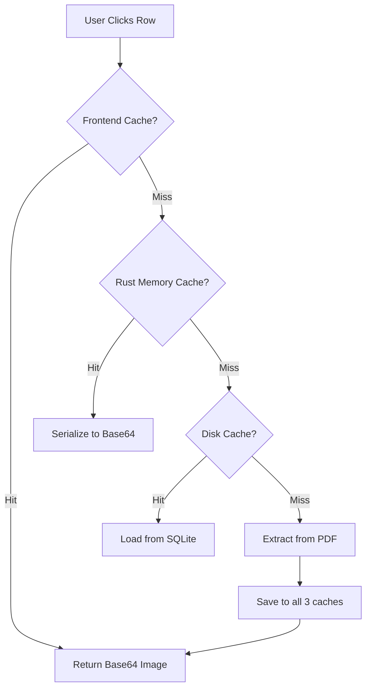

# EVIDENCE LOADING STRATEGY v1.0 (DEFENSIVE)

## 🎯 Philosophy
**"Never trust, always verify. Never load what you don't need."**

Evidence loading must be:
- **Lazy**: Only load when requested
- **Defensive**: Multiple fallback strategies
- **Bounded**: Hard memory limits enforced
- **Transparent**: User sees loading state, not freezes

---

## 1. MEMORY MANAGEMENT TIERS

### Tier 1: Small Files (<50MB)
```rust
Strategy::InMemory {
    max_concurrent: 3,
    evidence_access: "instant",
    ram_budget: "150MB max total"
}
```
- **Rationale**: Small enough to not cause OOM on 8GB machines
- **Risk**: Multiple large tables in one PDF could spike memory
- **Mitigation**: Pre-check table count, downgrade to Tier 2 if >1000 tables

### Tier 2: Medium Files (50-200MB)
```rust
Strategy::MemoryMappedWithFallback {
    test_phase: "parse first 2 pages only",
    max_concurrent: 2,
    fallback_to: "Streaming" // if mmap fails
}
```
- **Rationale**: Sweet spot for mmap if supported
- **Risk**: Docling may copy mmap to Python heap
- **Mitigation**: Test with `try_mmap_strategy()` before committing

### Tier 3: Large Files (>200MB)
```rust
Strategy::Streaming {
    chunk_size: "10 pages per batch",
    max_concurrent: 1,
    evidence_mode: "on-demand page load"
}
```
- **Rationale**: Safety first, cannot risk OOM
- **Risk**: Slower evidence access (need to seek to page)
- **Mitigation**: Aggressive page caching (see Section 2)

---

## 2. TRIPLE-LAYER CACHING ARCHITECTURE



### Layer 1: Frontend Cache (Browser Memory)
```typescript
interface FrontendCache {
    type: "LRU",
    max_items: 50,
    max_size_mb: 10,
    eviction: "least recently viewed"
}
```
- **Purpose**: Instant evidence display for recent views
- **Lifetime**: Current session only
- **Clear trigger**: File reload or project switch

### Layer 2: Rust Memory Cache (App RAM)
```rust
struct MemoryCache {
    pages: LruCache<PageKey, CompressedPage>,
    max_items: 100,
    max_size_mb: 50,
    compression: "JPEG quality 85"
}

struct PageKey {
    file_hash: String,
    page_num: usize,
    dpi: u16
}
```
- **Purpose**: Fast access without disk I/O
- **Lifetime**: Until app restart
- **Clear trigger**: Memory pressure >80% system RAM

### Layer 3: Disk Cache (SQLite Persistent)
```sql
CREATE TABLE evidence_cache (
    id TEXT PRIMARY KEY,
    file_hash TEXT,
    page_num INTEGER,
    bbox_hash TEXT,
    image_blob BLOB,
    created_at DATETIME,
    last_accessed DATETIME
);

CREATE INDEX idx_evidence_access ON evidence_cache(file_hash, page_num);
```
- **Purpose**: Survive app restarts
- **Lifetime**: Until manual clear or 30 days unused
- **Size limit**: 500MB total, auto-prune oldest

---

## 3. IPC PROTOCOL SPECIFICATION

### Request Structure
```rust
#[derive(Serialize, Deserialize)]
struct EvidenceRequest {
    request_id: String,          // UUID for tracking
    file_path: PathBuf,
    page_index: usize,           // 0-based
    bbox: [f32; 4],              // [x, y, width, height] in PDF coords
    dpi: u16,                    // 72, 150, or 300
    priority: Priority           // Immediate, Normal, Background
}

enum Priority {
    Immediate,  // User clicked, needs <500ms response
    Normal,     // User hovered, needs <2s response
    Background  // Prefetch, can wait
}
```

### Response Structure
```rust
#[derive(Serialize, Deserialize)]
enum EvidenceResponse {
    Success {
        request_id: String,
        data_base64: String,
        mime_type: String,       // "image/jpeg"
        dimensions: (u32, u32),
        cache_hit: bool          // For monitoring
    },
    Pending {
        request_id: String,
        queue_position: usize,
        estimated_wait_ms: u64
    },
    Error {
        request_id: String,
        error_type: ErrorType,
        retry_after_ms: Option<u64>
    }
}

enum ErrorType {
    FileNotFound,
    PageOutOfRange,
    MemoryExhausted,      // Critical: triggers emergency GC
    TimeoutExceeded,
    ParsingFailed
}
```

### Rate Limiting Rules
```rust
const MAX_REQUESTS_PER_SEC: usize = 20;
const MAX_CONCURRENT_EXTRACTIONS: usize = 3;
const TIMEOUT_MS: u64 = 3000;
const BACKOFF_MULTIPLIER: f64 = 1.5;

struct RateLimiter {
    window: Duration,          // 1 second
    requests: VecDeque<Instant>,
    semaphore: Arc<Semaphore>  // Limit concurrent PDF operations
}
```

---

## 4. PREFETCHING STRATEGY

### Hover-Based Prefetch
```typescript
// Frontend behavior
let hoverTimeout: NodeJS.Timeout;

function onRowHover(rowId: string) {
    hoverTimeout = setTimeout(() => {
        // Only prefetch if user lingers >300ms
        const evidence = getEvidenceMetadata(rowId);
        prefetchEvidence(evidence, Priority.Normal);
    }, 300);
}

function onRowUnhover() {
    clearTimeout(hoverTimeout);
}
```

### Viewport-Based Prefetch
```typescript
// Prefetch evidence for visible + 5 rows above/below
useEffect(() => {
    const visibleRange = virtualizer.getVisibleRange();
    const prefetchRange = {
        start: Math.max(0, visibleRange.start - 5),
        end: Math.min(totalRows, visibleRange.end + 5)
    };
    
    // Batch request for efficiency
    const evidenceIds = getPrefetchList(prefetchRange);
    batchPrefetch(evidenceIds, Priority.Background);
}, [virtualizer.scrollOffset]);
```

---

## 5. FALLBACK MECHANISMS

### Scenario 1: Memory Exhaustion
```rust
async fn handle_memory_pressure() {
    log::warn!("Memory pressure detected");
    
    // Step 1: Clear Rust memory cache aggressively
    state.evidence_cache.clear();
    
    // Step 2: Force Python GC if using Docling
    python_bridge.force_gc().await?;
    
    // Step 3: If still critical, kill and restart worker
    if is_memory_critical() {
        python_bridge.restart_worker().await?;
    }
    
    // Step 4: Notify frontend to clear cache
    emit_event("memory-pressure", MemoryPressureLevel::High);
}
```

### Scenario 2: Docling Hang
```rust
async fn extract_with_timeout(req: EvidenceRequest) -> Result<Image> {
    tokio::time::timeout(
        Duration::from_secs(3),
        docling_extract(req)
    ).await
    .map_err(|_| Error::Timeout)?
}
```

### Scenario 3: IPC Queue Overflow
```typescript
// Frontend handling
if (response.type === 'Pending' && response.queue_position > 50) {
    // Too many pending requests, show degraded UI
    showPlaceholder({
        type: "overloaded",
        message: "System busy, click to retry",
        retryFn: () => retryEvidence(requestId)
    });
}
```

---

## 6. MONITORING & OBSERVABILITY

### Metrics to Track
```rust
struct EvidenceMetrics {
    total_requests: u64,
    cache_hit_rate: f64,        // Target: >70%
    avg_response_time_ms: f64,  // Target: <500ms for Immediate
    memory_usage_mb: f64,       // Alert if >200MB
    queue_depth: usize,         // Alert if >20
    error_rate: f64             // Alert if >5%
}
```

### Health Check Endpoint
```rust
#[tauri::command]
async fn evidence_health() -> HealthReport {
    HealthReport {
        status: if metrics.error_rate < 0.05 { "healthy" } else { "degraded" },
        metrics: current_metrics(),
        recommendations: vec![
            if cache_hit_rate < 0.5 { "Increase cache size" },
            if avg_response > 1000 { "PDF file too large, consider splitting" }
        ]
    }
}
```

---

## 7. TESTING STRATEGY

### Unit Tests
```rust
#[cfg(test)]
mod tests {
    #[tokio::test]
    async fn test_tier_selection() {
        assert_eq!(select_tier(10_000_000), Tier::InMemory);
        assert_eq!(select_tier(100_000_000), Tier::MemoryMapped);
        assert_eq!(select_tier(500_000_000), Tier::Streaming);
    }
    
    #[tokio::test]
    async fn test_cache_eviction() {
        let mut cache = MemoryCache::new(3);
        cache.insert(key1, page1);
        cache.insert(key2, page2);
        cache.insert(key3, page3);
        cache.insert(key4, page4); // Should evict key1
        
        assert!(cache.get(&key1).is_none());
        assert!(cache.get(&key4).is_some());
    }
}
```

### Integration Tests
```rust
#[tokio::test]
async fn test_evidence_extraction_e2e() {
    let test_pdf = create_test_pdf_500mb();
    let manager = PdfManager::new(test_pdf).await?;
    
    // Request evidence from middle of document
    let request = EvidenceRequest {
        page_index: 250,
        bbox: [100.0, 200.0, 50.0, 30.0],
        dpi: 150,
        priority: Priority::Immediate
    };
    
    let start = Instant::now();
    let response = manager.extract_evidence(request).await?;
    let elapsed = start.elapsed();
    
    assert!(elapsed < Duration::from_secs(2));
    assert!(response.data_base64.len() > 0);
}
```

### Stress Tests
```bash
# Simulate 100 concurrent evidence requests
cargo test --release -- --test-threads=1 stress_test_evidence_queue

# Monitor memory during test
heaptrack ./target/release/tachfileto-gui
```

---

## 8. FUTURE OPTIMIZATIONS (Post-MVP)

### v1.1: Smart Prefetch with ML
- Use user behavior to predict next evidence request
- Train lightweight model on row access patterns

### v1.2: Incremental Rendering
- Stream evidence at multiple quality levels (progressive JPEG)
- Show low-res placeholder → upgrade to high-res

### v1.3: Worker Pool
- Multiple Python workers for parallel evidence extraction
- Load balance based on page complexity

---

## 9. DECISION TREE FOR IMPLEMENTATION

```
START
  ↓
Measure file size
  ↓
<50MB? ─YES→ Use InMemory strategy
  │           └→ Test: Can load 3 files simultaneously?
  │                ├─NO→ Reduce to max_concurrent=2
  │                └─YES→ Continue
  NO
  ↓
<200MB? ─YES→ Test mmap compatibility
  │            ├─Works→ Use MemoryMapped
  │            └─Fails→ Use Streaming
  NO
  ↓
Use Streaming (mandatory for safety)
  └→ Set chunk_size based on available RAM
     ├─16GB RAM → 20 pages/chunk
     └─8GB RAM → 10 pages/chunk
```

---

## 10. CHECKLIST BEFORE IMPLEMENTATION

- [ ] Run `pdf_memory_bench` with real 500MB file
- [ ] Verify Docling's mmap compatibility (critical!)
- [ ] Measure baseline memory usage (Docling idle vs active)
- [ ] Test cache eviction under memory pressure
- [ ] Benchmark IPC latency (Rust ↔ JS round-trip time)
- [ ] Create fallback UI for all error states
- [ ] Document expected memory footprint per tier

---

**VERSION**: 1.0.0  
**STATUS**: Draft - Pending Benchmark Results  
**NEXT REVIEW**: After `pdf_memory_bench` execution  
**OWNER**: TachFileTo Core Team
